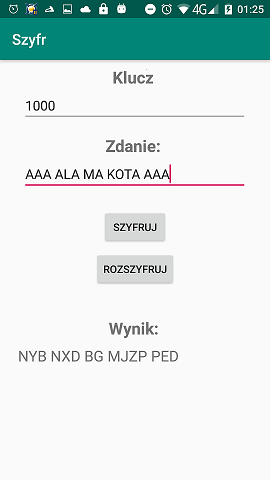

# Pseudo-random-encryption
This project is about possibility to encrypt a piece of sentences. In this is used pseudo-random encryption. So we enter a sample sentence, and each letter is encoded by random-choosed letter with english alphabet. So this encryption is similar to Ceasar cipher, but in this project, the encryption process is pseudo-random

 <code> ---</code>  

On the left is encode image, on the right is decode image.

## Sources
https://eduinf.waw.pl/inf/alg/001_search/0064.php -  theory about encode and decode each letter in example sentence. Retrieved 13 October 2020.(pol.) 
 
https://eduinf.waw.pl/inf/alg/001_search/0020.php#LCG - theory about LCG generator. Retrieved 13 October 2020. (pol.)
